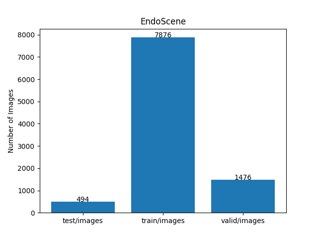
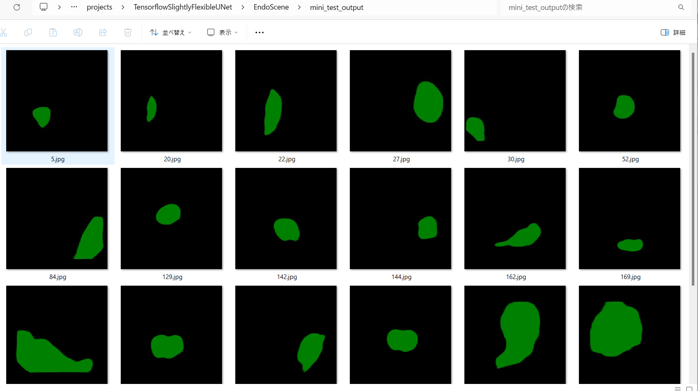
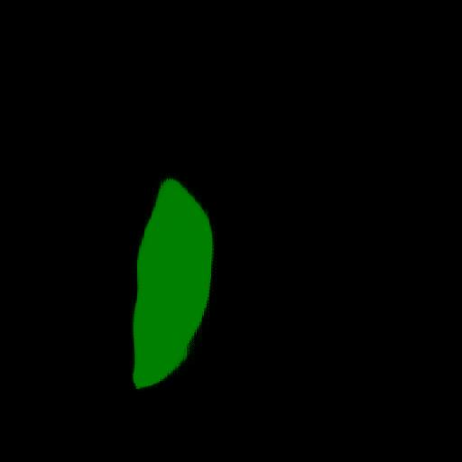

<h2>Tensorflow-Image-Segmentation-Pre-Augmented-CVC-EndoSceneStill (2025/01/01)</h2>

This is the first experiment of Image Segmentation for EndoScene (Endoluminal Scene of Colonoscopy Images)
 based on 
the latest <a href="https://github.com/sarah-antillia/Tensorflow-Image-Segmentation-API">Tensorflow-Image-Segmentation-API</a>, 
and a pre-augmented <a href="https://drive.google.com/file/d/1CK3cRrvJqlRKLmKSc7WL708PBxFd9pqX/view?usp=sharing">
EndoScene-ImageMask-Dataset.zip</a>, which was derived by us from 
<a href="https://drive.google.com/file/d/1MuO2SbGgOL_jdBu3ffSf92feBtj8pbnw/view?usp=sharing">
 CVC-EndoSceneStill 
</a>
 dataset 
  
<b>Data Augmentation Strategy:</b> 
 To address the limited size of CVC-EndoSceneStill,which contains 547 images and their corresponding masks in the TrainDataset, 
 we employed <a href="./generator/ImageMaskDatasetGenerator.py">an offline augmentation tool</a> to generate a pre-augmented dataset, which supports the following augmentation methods.
  
<li>Vertical flip</li>
<li>Horizontal flip</li>
<li>Rotation</li>
<li>Shrinks</li>
<li>Shears</li> 
<li>Deformation</li>
<li>Distortion</li>
<li>Barrel distortion</li>
<li>Pincushion distortion</li>
 
Please see also the following tools  
<li><a href="https://github.com/sarah-antillia/Image-Deformation-Tool">Image-Deformation-Tool</a></li>
<li><a href="https://github.com/sarah-antillia/Image-Distortion-Tool">Image-Distortion-Tool</a></li>
<li><a href="https://github.com/sarah-antillia/Barrel-Image-Distortion-Tool">Barrel-Image-Distortion-Tool</a></li>

 

<b>Actual Image Segmentation for Images of 512x512 pixels</b> 
As shown below, the inferred masks look similar to the ground truth masks.  

<table>
<tr>
<th>Input: image</th>
<th>Mask (ground_truth)</th>
<th>Prediction: inferred_mask</th>
</tr>
<tr>
<td></td>
<td></td>
<td></td>
</tr>

<tr>
<td></td>
<td></td>
<td></td>
</tr>

<tr>
<td></td>
<td></td>
<td></td>
</tr>
</table>

 
In this experiment, we used the simple UNet Model 
<a href="./src/TensorflowUNet.py">TensorflowSlightlyFlexibleUNet</a> for this EndoScene Segmentation Model. 
As shown in <a href="https://github.com/sarah-antillia/Tensorflow-Image-Segmentation-API">Tensorflow-Image-Segmentation-API</a>.
you may try other Tensorflow UNet Models: 

<li><a href="./src/TensorflowSwinUNet.py">TensorflowSwinUNet.py</a></li>
<li><a href="./src/TensorflowMultiResUNet.py">TensorflowMultiResUNet.py</a></li>
<li><a href="./src/TensorflowAttentionUNet.py">TensorflowAttentionUNet.py</a></li>
<li><a href="./src/TensorflowEfficientUNet.py">TensorflowEfficientUNet.py</a></li>
<li><a href="./src/TensorflowUNet3Plus.py">TensorflowUNet3Plus.py</a></li>
<li><a href="./src/TensorflowDeepLabV3Plus.py">TensorflowDeepLabV3Plus.py</a></li>

 

<h3>1. Dataset Citation</h3>
The dataset used here has been take from the following google drive 
<a href="https://drive.google.com/file/d/1CK3cRrvJqlRKLmKSc7WL708PBxFd9pqX/view?usp=sharing">
 CVC-EndoSceneStill </a>
 
On <b>CVC-EndoSceneStill</b> dataset,   
please refer to :<a href="<b>A Benchmark for Endoluminal Scene Segmentation of Colonoscopy Images</b> 
 <a href="https://onlinelibrary.wiley.com/doi/10.1155/2017/4037190">
<b>A Benchmark for Endoluminal Scene Segmentation of Colonoscopy Images</b></a> 

 
<h3>
<a id="2">
2 EndoScene ImageMask Dataset
</a>
</h3>
 If you would like to train this EndoScene Segmentation model by yourself,
 please download the dataset from the google drive  
<a href="">
EndoScene-ImageMask-Dataset.zip</a>
, expand the downloaded ImageMaskDataset and put it under <b>./dataset</b> folder to be
<pre>
./dataset
└─EndoScene
    ├─test
    │   ├─images
    │   └─masks
    ├─train
    │   ├─images
    │   └─masks
    └─valid
        ├─images
        └─masks
</pre>
 

On the derivation of this dataset, please refer to the following Python scripts:
<li><a href="./generator/ImageMaskDatasetGenerator.py">ImageMaskDatasetGenerator.py</a></li>
<li><a href="./generator/split_master.py">split_master.py</a></li>
 
The folder structure of the original EndoScene is the following. 
<pre>
./EndoScene
├─TestDataset
│  ├─boundary
│  ├─images
│  └─masks
├─TrainDataset
│  ├─boundary
│  ├─images
│  └─masks
└─ValidationDataset
    ├─boundary
    ├─images
    └─masks
</pre>
The is a 512x512 pixels pre-augmented dataset generated by the ImageMaskDatasetGenerator.py from the TrainDataset only.
 
 
<b>EndoScene Statistics</b> 
 
 
As shown above, the number of images of train and valid datasets is enough to use for a training set of our segmentation model.
 
 
<b>Train_images_sample</b> 

 
<b>Train_masks_sample</b> 

 

<h3>
3 Train TensorflowUNet Model
</h3>
 We have trained EndoSceneTensorflowUNet Model by using the following
<a href="./projects/TensorflowSlightlyFlexibleUNet/EndoScene/train_eval_infer.config"> <b>train_eval_infer.config</b></a> file.  
Please move to ./projects/TensorflowSlightlyFlexibleUNet/EndoScene and run the following bat file. 
<pre>
>1.train.bat
</pre>
, which simply runs the following command. 
<pre>
>python ../../../src/TensorflowUNetTrainer.py ./train_eval_infer.config
</pre>

<b>Model parameters</b> 
Defined a small <b>base_filters = 16 </b> and large <b>base_kernels = (9,9)</b> for the first Conv Layer of Encoder Block of 
<a href="./src/TensorflowUNet.py">TensorflowUNet.py</a> 
and a large num_layers (including a bridge between Encoder and Decoder Blocks).
<pre>
[model]
base_filters   = 16
base_kernels   = (9,9)
num_layers     = 8
dropout_rate   = 0.03
dilation       = (3,3)
</pre>

<b>Learning rate</b> 
Defined a small learning rate.  
<pre>
[model]
learning_rate  = 0.00005
</pre>

<b>Online augmentation</b> 
Disabled our online augmentation tool. 
<pre>
[model]
model         = "TensorflowUNet"
generator     = False
</pre>

<b>Loss and metrics functions</b> 
Specified "bce_dice_loss" and "dice_coef". 
<pre>
[model]
loss           = "bce_dice_loss"
metrics        = ["dice_coef"]
</pre>
<b >Learning rate reducer callback</b> 
Enabled learing_rate_reducer callback, and a small reducer_patience.
<pre> 
[train]
learning_rate_reducer = True
reducer_factor     = 0.3
reducer_patience   = 4
</pre>

<b>Early stopping callback</b> 
Enabled early stopping callback with patience parameter.
<pre>
[train]
patience      = 10
</pre>

<b>Epoch change inference callbacks</b> 
Enabled epoch_change_infer callback. 
<pre>
[train]
epoch_change_infer       = True
epoch_change_infer_dir   =  "./epoch_change_infer"
epoch_changeinfer        = False
epoch_changeinfer_dir    = "./epoch_changeinfer"
num_infer_images         = 6
</pre>

By using this callback, on every epoch_change, the inference procedure can be called
 for 6 images in <b>mini_test</b> folder. This will help you confirm how the predicted mask changes 
 at each epoch during your training process.    

<b>Epoch_change_inference output at starting</b> 
 
 
<b>Epoch_change_inference output at ending</b> 
 
 

In this experiment, the training process was stopped at epoch 97  by EarlyStopping Callback.  
 
 

<a href="./projects/TensorflowSlightlyFlexibleUNet/EndoScene/eval/train_metrics.csv">train_metrics.csv</a> 
 

 
<a href="./projects/TensorflowSlightlyFlexibleUNet/EndoScene/eval/train_losses.csv">train_losses.csv</a> 
 

 

<h3>
4 Evaluation
</h3>
Please move to a <b>./projects/TensorflowSlightlyFlexibleUNet/EndoScene</b> folder, 
and run the following bat file to evaluate TensorflowUNet model for EndoScene. 
<pre>
./2.evaluate.bat
</pre>
This bat file simply runs the following command.
<pre>
python ../../../src/TensorflowUNetEvaluator.py ./train_eval_infer_aug.config
</pre>

Evaluation console output: 

  Image-Segmentation-EndoScene

<a href="./projects/TensorflowSlightlyFlexibleUNet/EndoScene/evaluation.csv">evaluation.csv</a> 

The loss (bce_dice_loss) to this EndoScene/test was low, and dice_coef high as shown below.
 
<pre>
loss,0.05
dice_coef,0.9338
</pre>
 

<h3>
5 Inference
</h3>
Please move to a <b>./projects/TensorflowSlightlyFlexibleUNet/EndoScene</b> folder 
,and run the following bat file to infer segmentation regions for images by the Trained-TensorflowUNet model for EndoScene. 
<pre>
./3.infer.bat
</pre>
This simply runs the following command.
<pre>
python ../../../src/TensorflowUNetInferencer.py ./train_eval_infer_aug.config
</pre>

<b>mini_test_images</b> 
 
<b>mini_test_mask(ground_truth)</b> 
 

<b>Inferred test masks</b> 
 
 

<b>Enlarged images and masks </b> 

<table>
<tr>
<th>Image</th>
<th>Mask (ground_truth)</th>
<th>Inferred-mask</th>
</tr>

<tr>
<td></td>
<td></td>
<td></td>
</tr>

<tr>
<td></td>
<td></td>
<td></td>
</tr>

<tr>
<td></td>
<td></td>
<td></td>
</tr>
<tr>
<td></td>
<td></td>
<td></td>
</tr>
<tr>
<td></td>
<td></td>
<td></td>
</tr>
<tr>
<td></td>
<td></td>
<td></td>
</tr>
</table>

 

<h3>
References
</h3>
<b>1. A Benchmark for Endoluminal Scene Segmentation of Colonoscopy Images</b> 
David Vázquez, Jorge Bernal, F. Javier Sánchez, Gloria Fernández-Esparrach, 
 Antonio M. López, Adriana Romero, Michal Drozdzal, Aaron Courville 
 <a href="https://onlinelibrary.wiley.com/doi/10.1155/2017/4037190">https://onlinelibrary.wiley.com/doi/10.1155/2017/4037190</a> 
 
First published: 26 July 2017  
<a href="https://doi.org/10.1155/2017/4037190">https://doi.org/10.1155/2017/4037190</a>
 
 

<b>2. Rethinking the transfer learning for FCN based polyp segmentation in colonoscopy</b> 
Yan Wen, Lei Zhang1, Xiangli Meng and Xujiong Ye 
<a href="https://arxiv.org/pdf/2211.02416">https://arxiv.org/pdf/2211.02416</a>
 
 
<b>3. Polyp detection and segmentation from endoscopy images</b> 
Mariia Kokshaikyna, Mariia Dobko, and Oles Dobosevych 
<a href="https://s3.eu-central-1.amazonaws.com/ucu.edu.ua/wp-content/uploads/sites/8/2022/12/MS-AMLV_2022_paper_7.pdf">
https://s3.eu-central-1.amazonaws.com/ucu.edu.ua/wp-content/uploads/sites/8/2022/12/MS-AMLV_2022_paper_7.pdf</a>
 

